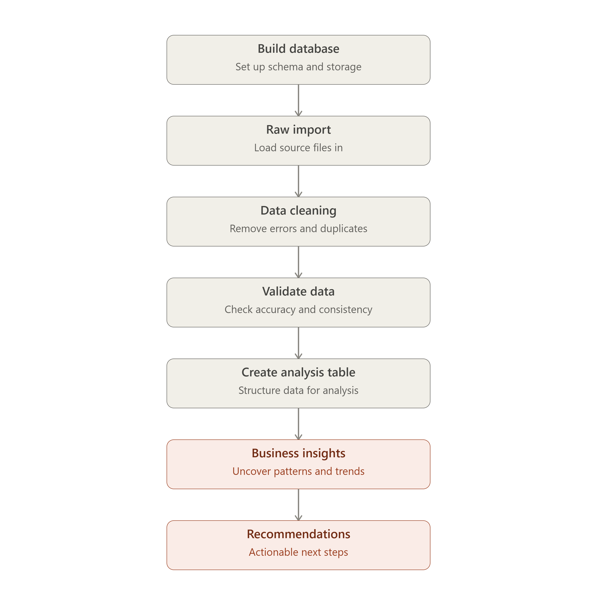
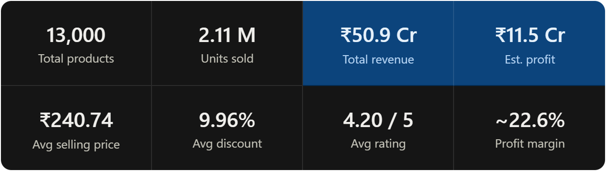

# Blinkit Quick Commerce Analytics -SQL Project


# Overview

This is a short, end-to-end SQL portfolio project on a Blinkit quick commerce dataset.

This project walks a raw Blinkit quick-commerce dataset through a complete analytics pipeline from schema design and fixing a real import error, through duplicate detection and data-quality validation, to ten SQL-driven business analyses covering sales, profit, cities, sellers, discounts, delivery, and inventory.

*Every finding below is backed by the exact SQL query that produced it (see blinkit_sql_queries.sql), paired here with charts and plain-language explanations of what the numbers actually mean for the business.*

---

# Workflow



# Project Steps

### 1) Setup (database + raw table)

Create the database and the `blinkit_raw` table with proper column types.

```sql
CREATE DATABASE IF NOT EXISTS blinkit_analytics;
USE blinkit_analytics;

CREATE TABLE blinkit_raw (
  product_id INT,
  product_name VARCHAR(255),
  category VARCHAR(100),
  brand VARCHAR(100),
  price DECIMAL(10,2),
  discount_pct DECIMAL(5,2),
  final_price DECIMAL(10,2),
  rating DECIMAL(3,2),
  num_reviews INT,
  delivery_time_min INT,
  city VARCHAR(100),
  seller VARCHAR(100),
  stock INT,
  sold_quantity INT,
  profit_margin_pct DECIMAL(5,2),
  is_organic VARCHAR(10),
  packaging_type VARCHAR(100),
  weight_g DECIMAL(10,2),
  shelf_life_days INT,
  reorder_level INT,
  demand_index DECIMAL(5,2),
  date_added DATE,
  expiry_date DATE,
  offer_type VARCHAR(100),
  delivery_status VARCHAR(50)
);
```

### 2) Import CSV + quick check

Importing CSV file into MYsql

```sql
USE blinkit_analytics;
SET GLOBAL local_infile = 1;

LOAD DATA LOCAL INFILE 'C:/Users/Lenovo/Downloads/blinkit_dataset.csv'
INTO TABLE blinkit_raw
FIELDS TERMINATED BY ','
OPTIONALLY ENCLOSED BY '"'
LINES TERMINATED BY '\n'
IGNORE 1 ROWS;
```

After importing via Workbench, confirm row count and preview a few rows.

```sql
SELECT COUNT(*) AS total_rows FROM blinkit_raw;
SELECT * FROM blinkit_raw LIMIT 10;
```

# 3) Duplicate issue → create clean table

After importing in `blinkit_raw`  table showed 19,231 rows instead of the expected 13,000 — was the file imported more than once?

- Total rows ≈ **19,231**
- Distinct product_id = **13,000**

That clearly shows **duplicates exist** (same product_id repeated).

These were accidental duplicate imports, not real data. SELECT DISTINCT was used to build blinkit_clean table with exactly one row per product (13,000 rows confirmed), while blinkit_raw was left untouched as the original source — so the raw import is always available to re-check the cleaning logic later.

```sql
CREATE TABLE blinkit_clean AS
SELECT DISTINCT *
FROM blinkit_raw;

SELECT COUNT(*) AS clean_rows FROM blinkit_clean;
```

**Result ( output):** `blinkit_clean = 13,000 rows`

# 4) **Validate data quality (fast checks)**

Once we got the final clean dataset (**13,000 rows**), we quickly validated it so our business insights are trustworthy. 

**What we found from the outputs**

- NULLs: **0**
- Invalid dates: **0**
- Price mismatches: **0**

Before running any analysis, every numeric and date column was checked for missing values, impossible ranges, and logical inconsistencies (e.g. an expiry date earlier than the date a product was added, or a final price that doesn't match price minus discount). This matters because a single business analysis built on bad data can produce a confidently wrong conclusion 

| **CHECK VALUES** | **RESULT** |
| --- | --- |
| NULL values  |   0 |
| is_organic |  True / False only |
| Price range |  ₹10.18 – ₹999.93   |
| Discount range |   0% – 30% |
| Rating range |   2.50 – 5.00 |
| Stock Range |   52 – 169   |
| Delivery time |   10 – 56 min   |
| Profit margin |   5% – 40%   |
| Invalid dates |   0  |
| Price calculation mismatches |   0 |

[Data Validation_screenshots.pdf](data_cleaning_screenshots.pdf)

# 5) Creating  Analysis Table

For easier analysis, convert organic flag into numeric.

```sql
CREATE TABLE blinkit_analysis AS
SELECT
  product_id,
  product_name,
  category,
  brand,
  price,
  discount_pct,
  final_price,
  rating,
  num_reviews,
  delivery_time_min,
  city,
  seller,
  stock,
  sold_quantity,
  profit_margin_pct,
  CASE WHEN is_organic = 'True' THEN 1 ELSE 0 END AS is_organic,
  packaging_type,
  weight_g,
  shelf_life_days,
  reorder_level,
  demand_index,
  date_added,
  expiry_date,
  offer_type,
  delivery_status
FROM blinkit_clean;
```

---

# Key insights (**Business Analysis**)

## 1) Overall business performance (KPIs)

How big is the business overall (products, sales, revenue, profit, ratings)?

**Output (your result)**

- Total products: **13,000**
- Total units sold: **2,111,201**
- Total revenue: **₹50.90 Cr**
- Estimated profit: **₹11.52 Cr**
- Avg selling price: **₹240.74**
- Avg discount: **9.96%**
- Avg rating: **4.20**

This gives strong “headline numbers” for your project. The business shows high volume, healthy customer rating, and strong estimated profitability.



---

## 2) Which categories generate the most revenue and profit?

1. **Household**: Revenue **₹12.06 Cr**, Est. Profit **₹2.75 Cr**
2. **Personal Care**: Revenue **₹9.98 Cr**, Est. Profit **₹2.23 Cr**
3. **Bakery**: Revenue **₹6.32 Cr**
4. **Grocery**: Revenue **₹6.32 Cr** (slightly higher profit than Bakery)

---


Household is the clear leader, generating ₹12.06 Cr in revenue and ₹2.75 Cr in estimated profit from just 1,560 products — meaningfully ahead of Personal Care in second place (₹9.98 Cr). Bakery and Grocery post almost identical revenue (₹6.32 Cr each), but Grocery converts slightly better into profit

## 3) Which brands are the top performers?

- **Britannia**: Revenue **₹3.15 Cr**, Est. Profit **₹71.05 L**, Units **162,780**
- **Harpic**: Revenue **₹3.15 Cr**, Est. Profit **₹72.71 L**, Units **63,393**
- **Dettol**: Revenue **₹2.98 Cr**, Est. Profit **₹70.32 L**, Avg rating **4.23**


Britannia is the #1 brand by revenue (₹3.15 Cr) and also sells by far the most units (162,780) of any brand in the top five. But Harpic, despite selling less than half as many units (63,393), actually earns slightly more estimated profit (₹72.71 L vs. Britannia's ₹71.05 L). Harpic's household-cleaning products likely carry a higher margin per unit, so it earns more from fewer sales , a reminder that a 'best-selling brand' report and a 'most profitable brand' report can point in different directions, and a business should track both.

---

## 4) Does giving discount increase sales?

- No Discount: **162.47**
- 1–5%: **158.62**
- 6–10%: **161.06**
- **11–20%: 165.82 (best)**
- 21–30%: **163.57**


**Insight**
There’s no simple “higher discount = higher sales” pattern. Moderate discounts (11–20%) worked best on average. Heavy discounts (21–30%) didn’t give a big extra lift.

---

## 5) Which cities perform best?

- **Pune**: Revenue **₹5.38 Cr** (highest)
- **Mumbai**: Units sold **219,930** (highest) + Avg rating **4.23** (highest)
- **Ahmedabad**: Est. profit **₹1.21 Cr** (highest)


Different cities lead on different metrics: Pune leads revenue, Mumbai leads volume and customer satisfaction, and Ahmedabad leads profit.

Pune tops the list on revenue (₹5.38 Cr), but only narrowly — the top six cities are all within about 15% of each other, so this is a fairly even market rather than one city dominating. Mumbai actually sells the most units (219,930) and has the highest average rating (4.23) despite ranking third on revenue, while Ahmedabad quietly leads on estimated profit (₹1.21 Cr).

---

## 6) Do we have products that need restocking?

*No product is below the reorder threshold in this dataset. So instead of “urgent restock,” the better business story is: monitor products with the smallest stock buffer, especially if demand is high.*


Therefore, nothing is at risk right now, but the products in the shaded high-demand zone of the chart above (small buffer + high demand index) are the ones likely to breach their reorder level first if sales keep pace. Flagging them for proactive restocking is a stronger recommendation than waiting for the reorder-level alert to fire, by which point it may already be too late to avoid a stockout.

---

### 7) Does delivery time affect sales?

- 10–15 min:  **160.20** (Avg rating **4.24**)
- 16–25 min:  **163.46**
- 26–35 min:  **162.58**
- 36–45 min:  **159.57**
- 46–56 min:  **165.38** (very small group: only 90 products)


Sales are quite similar across delivery bands, so delivery time doesn’t look like a strong sales driver here. However, the fastest delivery band has very high ratings, so speed may improve customer experience more than sales volume.

---

## 8) Which sellers perform best?

- **DailyNeeds**: Revenue **₹8.68 Cr** (highest)
- **SellerA**: Est. profit **₹2.02 Cr** (highest)


All six sellers perform within a fairly tight band, but DailyNeeds edges ahead on revenue (₹8.68 Cr). SellerA, despite ranking second on revenue (₹8.57 Cr), actually earns the most estimated profit (₹2.02 Cr) — and QuickStores, while not leading on either revenue or profit, sells more individual units (354,800) than any other seller.

The same pattern shows up here as it did with brands and cities: the seller who sells the most isn't the seller who earns the most. This likely comes down to product mix . SellerA may carry a higher share of high-margin categories like Household  and it's a good argument for evaluating sellers on profit contribution, not just top-line sales.

---

## 9) Organic vs Non-organic performance

- **Non-Organic**: Products **9,832**, Revenue **₹38.50 Cr**, Est. Profit **₹8.66 Cr**, Avg rating **4.20**
- **Organic**: Products **3,168**, Revenue **₹12.40 Cr**, Est. Profit **₹2.86 Cr**, Avg rating **4.19**


Non-organic products make up about 76% of the catalog (9,832 of 13,000 products) and generate almost exactly that same 76% share of revenue (₹38.50 Cr of the ₹50.90 Cr total)  so revenue share simply tracks catalog share. Organic products do carry a modestly higher average price (₹243.87 vs. ₹239.73), but average customer rating is essentially identical between the two groups (4.19 vs. 4.20).

Non-organic dominates because it has much larger assortment and higher volume. Organic has slightly higher average price, but similar rating and lower overall contribution mainly due to fewer products.

---

## 10) Top 10 most profitable products (profit heroes)

- #1: **Harpic Premium Household 143** — Est. Profit **₹1.71 lakh**
- Many top-10 products belong to **Household**, and brands like **Harpic** and **Lizol** repeat multiple times.


Household products are the strongest profit contributors at product level. This supports the category-level finding that Household is the most valuable segment.

 These products aren't profitable because of any one factor alone  they combine solid sales volume, a relatively high selling price (mostly ₹770–₹995), and strong profit margins (up to 38.6% for Harpic Fresh Household 820). That combination is a useful template: when deciding which new products or categories to push, look for the same three ingredients together rather than optimizing for just one.   

---

# Recommendations To The Management

1. **Invest more in Household + Personal Care** (assortment depth, visibility, bundles) since they drive revenue/profit.
2. **Use smarter discounting:** focus promotions around **11–20%** and test by category/brand instead of heavy blanket discounts.
3. **Manage by profit, not only revenue:** prioritize high-profit brands/sellers (profit leaders differ from revenue leaders).
4. **City strategy:** replicate what works in **Pune** (revenue), and use **Mumbai** strengths (volume + rating) for retention campaigns.
5. **Proactive inventory monitoring:** track **stock buffer + demand index** to prevent future stockouts.
6. **Delivery as customer-experience lever:** fastest delivery correlates with better ratings—use it strategically for key segments.
7. **Organic growth carefully:** expand organic where customers pay premium; test pricing and bundles rather than scaling blindly.

> RANBIR SINGH
DELHI TECHNOLOGICAL UNIVERSITY
[Linkedin](https://www.linkedin.com/in/ranbir-singh-610969130/) | [imranbir03@gmail.com](mailto:imranbir03@gmail.com)
>
